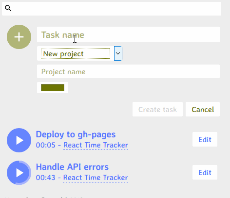

# React Time Tracker

**[OPEN DEMO.](https://mauroc8.github.io/react-time-tracker/)**

A minimal time-tracking web app. Made to learn [react hooks](https://reactjs.org/docs/hooks-intro.html).
It features:

- [x] Show tasks.
- [x] Create tasks.
- [x] Edit tasks.
- [x] Delete tasks.
- [x] Start/end time record on a task.
- [x] Filter tasks by project.
- [x] Drag and drop to reorder tasks (in desktop browsers).
- [x] Export tasks to a file.
- [x] Import tasks from a file.

## Run

> Make sure npm is updated.

1. `npm install` (only the first time)
2. `npm start`

## Backend

The site uses a [mocked API](src/mockAdapter.js) which basically saves everything to both localStorage and cookies.

To make a real API for this app, please read the [API specification](API-specification.md). Then run with an enviroment variable:

- Linux: `REACT_APP_API="https://my-real-api.com" npm start`
- Windows (powershell): `$env:REACT_APP_API="https://my-real-api.com"` and `npm start`

Please contact me to solve integration issues that may arise.

## Run tests

`npm test`

You can also test using your own API (setting the enviroment variable also works here).

> No all features have tests.

> The test suite will only wait 300 ms for http requests.

## License

Published under [MIT License](LICENSE.md).
